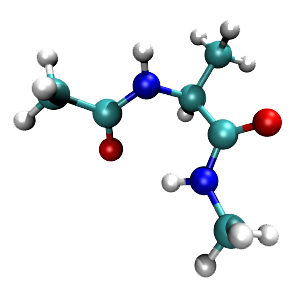

# pDynamo3 (ORCA >=6.0 compatible fork)



**This is a fork of [pDynamo3](https://github.com/dynamo.modeling/pdynamo3) modified to ensure compatibility with ORCA version 6.0 and above.**  
Original development: Martin Field and the pDynamo team.

pDynamo is an open source program library designed for the simulation of molecular systems using quantum chemical (QC), molecular mechanical (MM), and hybrid QC/MM potential energy functions. pDynamo is written in Python, with computationally intensive components implemented in C and Cython. The current version, pDynamo3, uses Python 3.

Principal author: Martin Field  
Development team: <dynamo.modeling@gmail.com>  
Released under the [GNU General Public License](gpl-3.0.txt)

---

## Features of pDynamo3
- Density functional theory and Hartree-Fock QC methods employing Gaussian basis sets
- Semi-empirical QC methods of the MNDO type, including AM1, MNDO, PDDG, PM3, RM1 and PM6
- Support for standard MM force fields (AMBER, CHARMM, OPLS-AA)
- Hybrid QC/MM methods using any combination of implemented QC and MM potentials
- Coupling to third-party programs (including DFTB+, ORCA, PySCF)
- Energy calculations, geometry optimizations, transition state searches
- Reaction path calculations, normal mode analyses
- Molecular dynamics and Monte Carlo simulations
- Property calculations (e.g., charges and dipoles)
- Various geometrical restraints
- Handling of multiple molecular file formats
- Miscellaneous analysis tools

---

## Changes in This Fork
- Updated `QCModelORCA` interface for compatibility with ORCA versions **≥ 6.0**.
- Minor adjustments for smoother use with newer Python 3 environments.

Otherwise, this fork preserves the structure, functionality, and philosophy of the original pDynamo3 project.

---

## Citation
If you use pDynamo in your work, please cite:

- M. J. Field, ["The *pDynamo* Library for Molecular Simulations using Hybrid Quantum Mechanical and Molecular Mechanical Potentials"](https://pubs.acs.org/doi/10.1021/ct800092p), *J. Chem. Theo. Comp.* **2008**, *4*, 1151-1161.
- M. J. Field, ["A Practical Introduction to the Simulation of Molecular Systems"](https://www.cambridge.org/core/books/practical-introduction-to-the-simulation-of-molecular-systems/E91B9A8E90237C3D63F6A589105FF38B), *Cambridge University Press*, **2007**.

---

## Installation Instructions
Required software and libraries:
- Python 3.5 or higher (plus headers; `python3-dev` on Debian)
- [Cython](https://cython.org/)
- PyYAML
- C compiler (e.g., gcc)

Clone or download this repository:

```bash
git clone git@github.com:T98G/pDynamo3.git
```

Navigate to the installation directory:

```bash
cd installation
python3 Install.py -f
```

**Environment variables:**  
Example (csh syntax):

```csh
setenv PDYNAMO3_HOME          $HOME/pDynamo3
setenv PDYNAMO3_SCRATCH       $PDYNAMO3_HOME/scratch
setenv PYTHONPATH             .:$PDYNAMO3_HOME
setenv PDYNAMO3_PARAMETERS    $PDYNAMO3_HOME/parameters
setenv PDYNAMO3_PYTHONCOMMAND python3
setenv PDYNAMO3_STYLE         $PDYNAMO3_PARAMETERS/ccsStyleSheets/defaultStyle.css
```

**Test the installation**:

```bash
python3 RunExamples.py book
```

---

## Third-Party Programs and Environment Variables
Some modules rely on external programs:
- **DFTB+** (`PDYNAMO3_DFTBCOMMAND`)
- **ORCA** (`PDYNAMO3_ORCACOMMAND`) — tested with **ORCA 6.0 and later**
- **PySCF** (`PDYNAMO3_PYSCFPATH`)
- **extended-MEAD** (`PDYNAMO3_MEADPATH`)

Example (csh syntax):

```csh
setenv PDYNAMO3_ORCACOMMAND /path/to/orca
```

---

## Additional Packages
Available in the `addOns` directory:
- [pcetk](https://github.com/mfx9/pcetk) — proton binding energetics
- [pyCPR](http://www.bisb.uni-bayreuth.de/index.php?page=data/PyCPR/PyCPR) — transition state searches

Please refer to their documentation for usage.

---

## Further Information
See the [original pDynamo website](https://sites.google.com/site/pdynamomodeling/home) for more tutorials and examples.

---

Would you also like me to prepare a shorter version for a GitHub repo summary ("About" section)?
